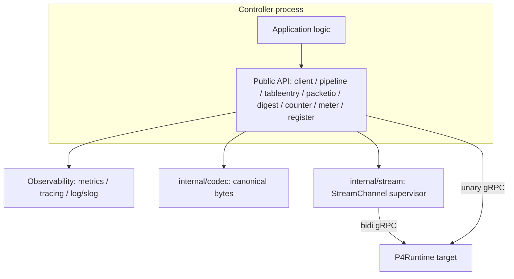
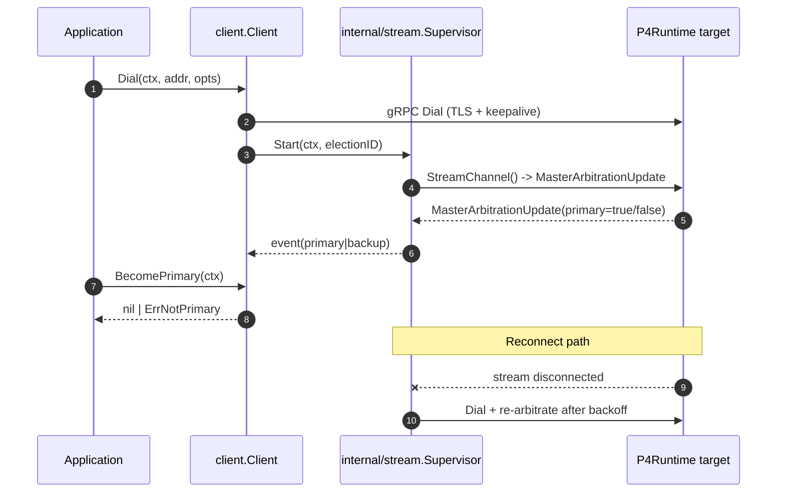
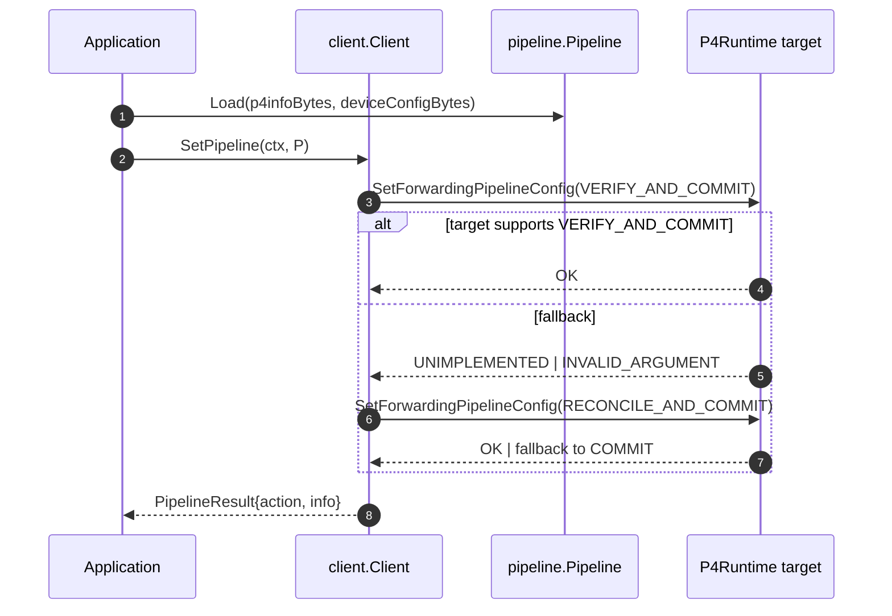
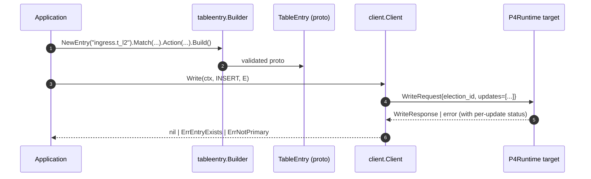
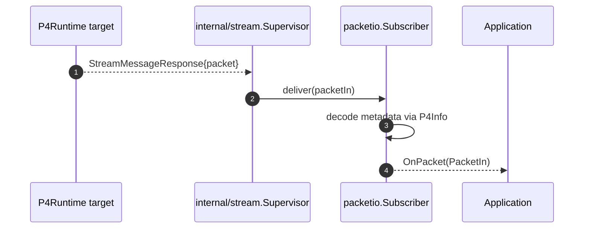

# Architecture

This document describes the layered design of `p4runtime-go-controller`, the
main data flows, and the key sequence diagrams. See
[`DESIGN_NOTES.md`](DESIGN_NOTES.md) for the rationale behind each choice.

## Layered View

The layering is strict: package `client` imports `internal/stream`, never the
reverse. The public `errors` package is the only one that is safe to import
from every other package.

## Session Lifecycle

## Pipeline Push

## Table Write

## Packet-In Round Trip

## Concurrency Model

- `client.Client` is safe for concurrent use. The gRPC stub is already
  goroutine-safe. State that is not (mastership flag, last-known election ID,
  stream handle) lives behind a `sync.RWMutex` with the narrowest possible
  critical section.
- `internal/stream.Supervisor` owns exactly one goroutine plus a receive
  goroutine per connected stream. Both terminate within a bounded deadline when
  the caller-provided context is cancelled.
- No `time.Sleep` without a select on `ctx.Done()`. No unbuffered goroutine
  leaks under `-race`.

## Error Classification

Sentinel errors in the public `errors` package let callers react
programmatically:

- `ErrNotPrimary` — operation requires primary mastership.
- `ErrPipelineNotSet` — target has no active pipeline yet.
- `ErrEntryExists` / `ErrEntryNotFound` — write-path idempotency helpers.
- `ErrUnsupportedMatchKind` — match kind not supported by the target pipeline.
- `ErrTargetUnsupported` — target does not support the attempted feature (e.g.,
  `VERIFY_AND_COMMIT`).
- `ErrStreamClosed` — stream was closed by the target or by `Client.Close`.

The concrete error type wraps the gRPC status so callers can still use
`status.FromError`.
