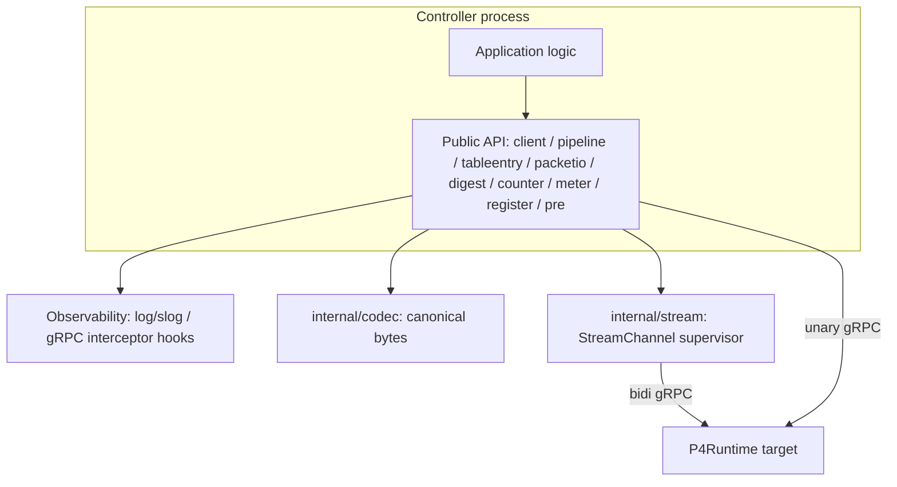
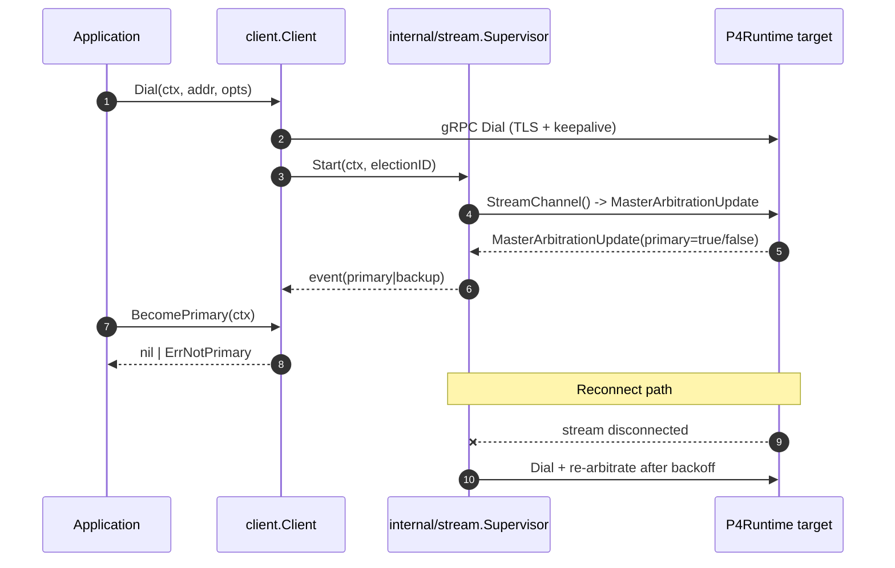
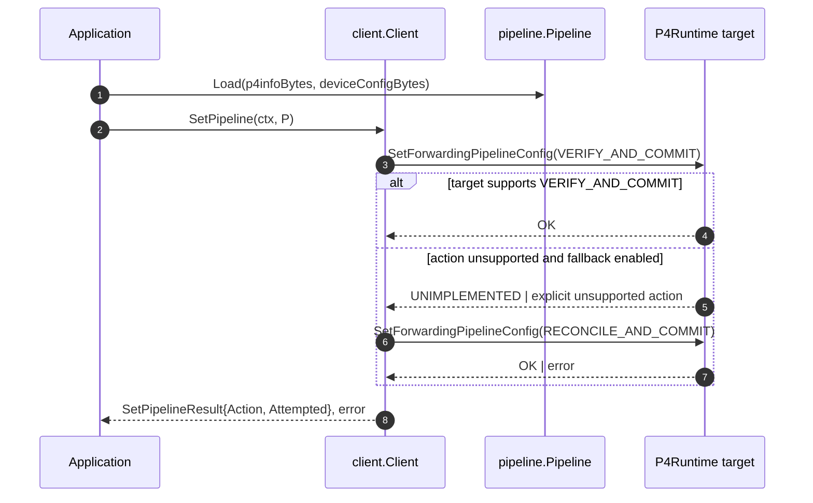
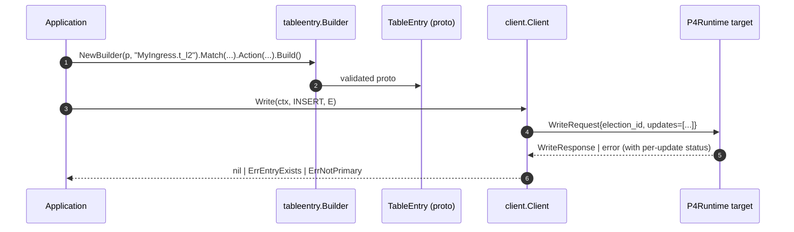
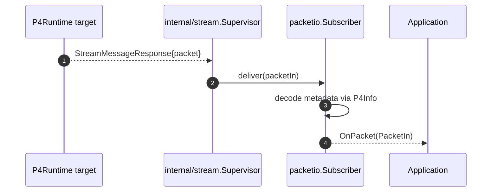

# Architecture

This document describes the package layout, session lifecycle, request flows, and design decisions in `p4runtime-go-controller`.

## Layered View

```mermaid
flowchart TD
    subgraph User[Controller process]
        app[Application logic]
        app --> api[Public API: client / pipeline / tableentry / packetio / digest / counter / meter / register / pre]
    end

    api --> obs[Observability: log/slog / gRPC interceptor hooks]
    api --> codec[internal/codec: canonical bytes]
    api --> stream[internal/stream: StreamChannel supervisor]

    stream -->|bidi gRPC| target[P4Runtime target]
    api -->|unary gRPC| target
```

The layering is strict: package `client` imports `internal/stream`, never the reverse. The public `errors` package is the only one that is safe to import from every other package.

## Session Lifecycle

```mermaid
sequenceDiagram
    autonumber
    participant App as Application
    participant C as client.Client
    participant S as internal/stream.Supervisor
    participant T as P4Runtime target

    App->>C: Dial(ctx, addr, opts)
    C->>T: gRPC Dial (TLS + keepalive)
    C->>S: Start(ctx, electionID)
    S->>T: StreamChannel() -> MasterArbitrationUpdate
    T-->>S: MasterArbitrationUpdate(primary=true/false)
    S-->>C: event(primary|backup)
    App->>C: BecomePrimary(ctx)
    C-->>App: nil | ErrNotPrimary

    Note over S,T: Reconnect path
    T--xS: stream disconnected
    S->>T: Dial + re-arbitrate after backoff
```

## Pipeline Push

```mermaid
sequenceDiagram
    autonumber
    participant App as Application
    participant C as client.Client
    participant P as pipeline.Pipeline
    participant T as P4Runtime target

    App->>P: Load(p4infoBytes, deviceConfigBytes)
    App->>C: SetPipeline(ctx, P)
    C->>T: SetForwardingPipelineConfig(VERIFY_AND_COMMIT)
    alt target supports VERIFY_AND_COMMIT
        T-->>C: OK
    else action unsupported and fallback enabled
        T-->>C: UNIMPLEMENTED | explicit unsupported action
        C->>T: SetForwardingPipelineConfig(RECONCILE_AND_COMMIT)
        T-->>C: OK | error
    end
    C-->>App: SetPipelineResult{Action, Attempted}, error
```

`VERIFY_AND_COMMIT` can fall back to `RECONCILE_AND_COMMIT` when unsupported. `NoFallback` disables this, including for the default action. Explicit `VERIFY`, `VERIFY_AND_SAVE`, `COMMIT`, and `RECONCILE_AND_COMMIT` run once. `COMMIT` accepts a nil pipeline and sends no config. It commits the target's previously saved config.

## Table Write

```mermaid
sequenceDiagram
    autonumber
    participant App as Application
    participant B as tableentry.Builder
    participant E as TableEntry (proto)
    participant C as client.Client
    participant T as P4Runtime target

    App->>B: NewBuilder(p, "MyIngress.t_l2").Match(...).Action(...).Build()
    B->>E: validated proto
    App->>C: Write(ctx, INSERT, E)
    C->>T: WriteRequest{election_id, updates=[...]}
    T-->>C: WriteResponse | error (with per-update status)
    C-->>App: nil | ErrEntryExists | ErrNotPrimary
```

## Packet-In Round Trip

```mermaid
sequenceDiagram
    autonumber
    participant T as P4Runtime target
    participant S as internal/stream.Supervisor
    participant P as packetio.Subscriber
    participant App as Application

    T-->>S: StreamMessageResponse{packet}
    S->>P: deliver(packetIn)
    P->>P: decode metadata via P4Info
    P-->>App: OnPacket(PacketIn)
```

## Concurrency Model

- The gRPC client supports concurrent calls. The stream supervisor guards its observable state with a `sync.RWMutex`.
- `internal/stream.Supervisor` runs a send loop and a receive goroutine for each connected stream.
- The main loop applies arbitration updates and publishes state events. It closes the event channel after canceling the active stream.
- Primary status follows the observable state. Disconnect, reconnect, and shutdown revoke mastership. A new stream must complete arbitration before it can be primary.
- `BecomePrimary` reads a state snapshot and waits on a change notification shared by all waiters. `Events` uses a separate bounded queue for observers.
- Packet, digest, and idle timeout handlers run in the receive goroutine. Handlers should return quickly and send slow work to a worker or channel.
- The dispatcher selects the current message's handlers under the subscription lock, then releases it before invoking them. Handlers can register or cancel subscriptions. Changes affect later messages, and cancellation does not wait for selected handlers to finish.
- A handler can call `Client.Close`. Close does not wait for a handler already in progress. The receive goroutine exits when the handler returns.

## Design Decisions

### Module and API compatibility

The v2 module path is `github.com/zhh2001/p4runtime-go-controller/v2`. The module stays at the repository root, and all SDK packages and examples use the `/v2` import prefix. Published v1 tags retain the unsuffixed module path. Both major versions can be dependencies of the same application. See [Release preparation](docs/releases.md).

### Session ownership

`Client` owns the gRPC connection and stream supervisor. The supervisor reopens StreamChannel and repeats arbitration after a disconnect, using exponential backoff with jitter.

The context passed to `Dial` bounds connection setup. The session has its own context so it can continue after `Dial` returns. Callers stop the session with `Client.Close` and pass a context to each blocking operation.

### Encoding and validation

The table entry builder encodes match fields and action parameters before a write request is sent. This lets callers inspect the resulting proto and report validation errors before making an RPC.

`pipeline.Pipeline` owns copies of its P4Info and device configuration and keeps indexes for lookups by name and ID. Info, Raw and resource queries return independent copies. External edits cannot change the stored configuration or later validation. Constructor inputs must remain unchanged until construction returns. New rejects pointer cycles and malformed nil message values before copying. Other validation stays with the resource APIs and target. The device configuration remains opaque and is passed to the target unchanged. See [Pipeline ownership](pipeline/README.md) for editing and identity rules.

Counter, meter and register readers accept `-1` to read the whole array. Other reads and all writes require a non-negative index. For ordinary indexes, the SDK checks the array size in P4Info before making an RPC. When `index_type_name` names a type, the target checks the index after any required translation. The SDK sends that non-negative value unchanged.

Counter writes include both packet and byte counts, as allowed by P4Runtime. The target applies its declared unit and value limits. Reads and writes preserve the int64 wire values. Explicit zero data clears the applicable counts. Direct counters use the raw client API. See [Indirect counters](counter/README.md) for value and unit semantics.

Meter writes require non-negative rates and bursts, and validate the field relationships declared by the meter type. `EBurst` represents the excess burst of single-rate three-color meters. Values retain their int64 range for target validation. `Reset` omits Config to restore default GREEN behavior, while `Write(Config{})` sends explicit zeros. See [Indirect meters](meter/README.md) for configuration rules and migration from legacy negative values.

Register writes validate values against the P4Info type declaration and copy them before the RPC. `Write` accepts fixed-width integer bytes. `WriteData` accepts typed `P4Data`, including compound values and translated types. Fixed-width integers use their shortest encoding, while varbits retain their explicit length and translated strings retain their bytes. See [Register arrays](register/README.md) for accepted representations and limits.

The `pre` package preserves the replica port's wire representation. Legacy `EgressPort` values use the uint32 field. `Port` holds opaque bytes, including translated port names and values wider than uint32. Reads retain the selected field, and read-modify-write retains backup replicas in order. Target support determines which port fields and backup configurations can be used. See [Packet replication](pre/README.md) for validation and caller migration.

### Logging and tracing

Logging uses `log/slog`, configured through `client.WithLogger`. Stream attempts and mastership changes use INFO. Stream failures use WARN, while retry delays, state transitions and normal shutdown use DEBUG. The default logger is `slog.Default`.

Applications can instrument gRPC through `WithUnaryInterceptor` and `WithStreamInterceptor`. The `metrics` package is reserved for future support and has no collector interface or adapters. See [Observability](docs/observability.md) for log fields, interceptor scope and event delivery limits.

### Election IDs

`ElectionID` stores a 128-bit unsigned value as `High` and `Low`. Comparisons use the high half first. `Increment` returns false at the maximum value and leaves the value unchanged, avoiding an accidental wrap to zero.

### Roles

`WithRole` applies the same name to arbitration, Write, Read and SetPipeline. The empty name selects the default full-access role. Read carries the name in `ReadRequest.role`, including wildcard reads and calls through the resource wrappers. Reading does not require primary status, and a rejected read is not retried with an empty role.

Read role filtering was introduced in [P4Runtime 1.4](https://github.com/p4lang/p4runtime/blob/v1.5.0/proto/p4/v1/p4runtime.proto). The target defines and enforces each role's scope. Targets that ignore this field can return entries outside that scope. The SDK does not filter responses locally or negotiate role support.

### Target capabilities

Write requests expose the P4Runtime atomicity setting. Support for rollback, data plane atomicity, and pipeline reconciliation depends on the target. Applications must handle unsupported operations.

Election coordination between controller processes is outside the SDK. Applications can use an external coordination service to assign election IDs.

Stream requests use a bounded queue. Send waits for the request's gRPC send to complete. Canceled queued requests are skipped, and requests from a failed stream are not replayed. Canceling a send already in progress can interrupt that stream. Receive handlers run inline, so their execution time affects the next receive.

Close aborts the session immediately. CloseGracefully(ctx) stops accepting stream requests, completes accepted sends, half-closes the StreamChannel, and waits for the target's final RPC status. It then closes the client even on timeout or failure. Use a deadline and call it outside receive handlers. Successful stream completion does not acknowledge individual PacketOut forwarding or digest processing.

## Error Classification

Sentinel errors in the public `errors` package let callers react programmatically:

- `ErrNotPrimary` — operation requires primary mastership.
- `ErrPipelineNotSet` — a pipeline query or operation reports that no pipeline is configured.
- `ErrEntryExists` / `ErrEntryNotFound` — write-path idempotency helpers.
- `ErrUnsupportedMatchKind` — match kind not supported by the target pipeline.
- `ErrTargetUnsupported` — target does not support the attempted feature (e.g., `VERIFY_AND_COMMIT`).
- `ErrStreamClosed` — stream was closed by the target or by `Client.Close`.

The concrete error type wraps the gRPC status so callers can still use `status.FromError`.

`GetPipeline` reports `ErrPipelineNotSet` for an absent config or P4Info in a successful response, and for explicit pipeline-missing `FailedPrecondition` responses. RPC errors keep the target's original code, message and details. The operation name appears in the error text, while `status.FromError` returns the target status unchanged.

Write RPC failures return `*errors.WriteError`. Its `Updates` slice contains one `p4.Error` per request update, in the original order, including successful updates with code `OK`. `errors.Is` matches any failed update. The RPC status retains its original code, message, and details, so a per-update failure still has RPC code `Unknown`. Missing or malformed results leave `Updates` nil.

For a partially successful batch, inspect each result and the requested atomicity before retrying. The SDK does not retry writes automatically.
