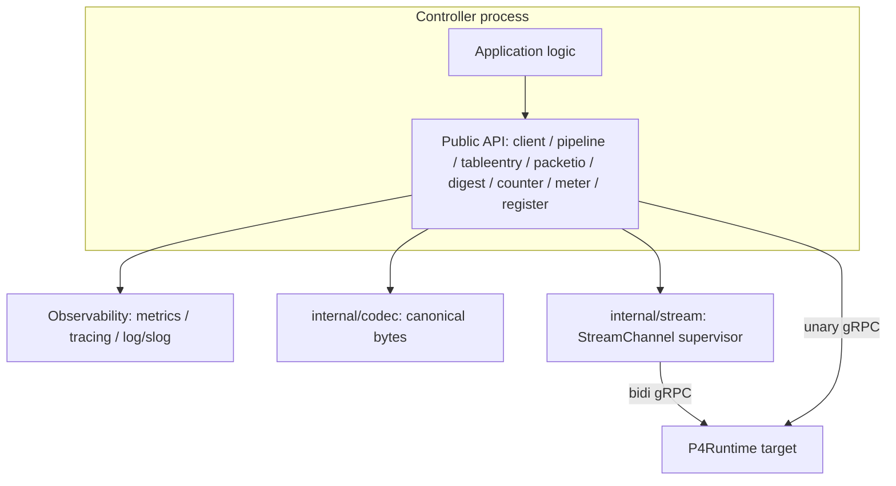
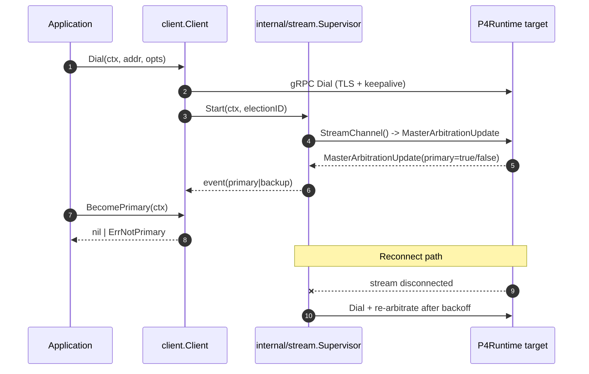
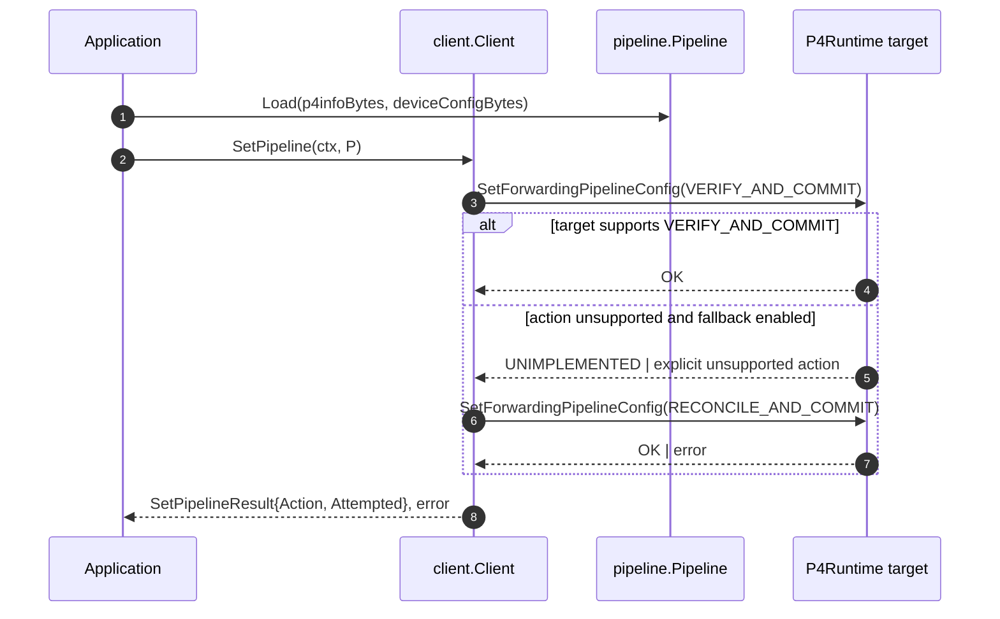
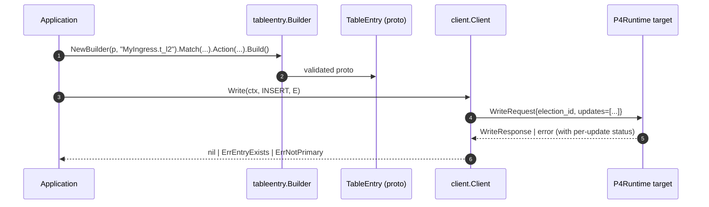
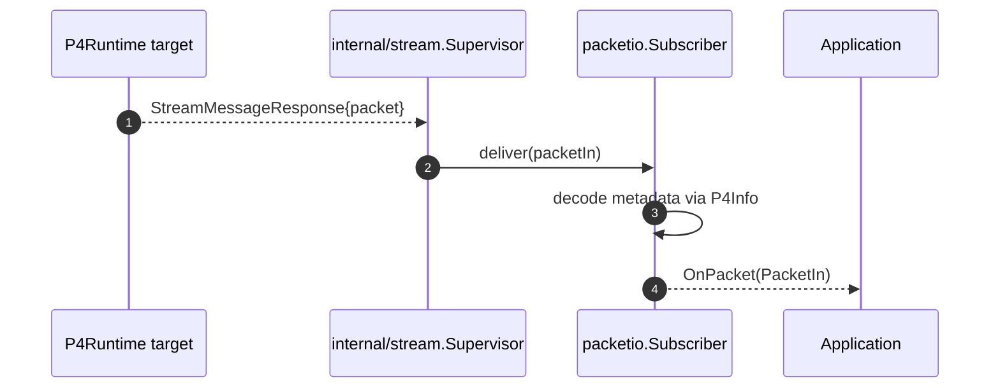

# Architecture

This document describes the package layout, session lifecycle, request flows, and design decisions in `p4runtime-go-controller`.

## Layered View

```mermaid
flowchart TD
    subgraph User[Controller process]
        app[Application logic]
        app --> api[Public API: client / pipeline / tableentry / packetio / digest / counter / meter / register]
    end

    api --> obs[Observability: metrics / tracing / log/slog]
    api --> codec[internal/codec: canonical bytes]
    api --> stream[internal/stream: StreamChannel supervisor]

    stream -->|bidi gRPC| target[P4Runtime target]
    api -->|unary gRPC| target
```

The layering is strict: package `client` imports `internal/stream`, never the reverse. The public `errors` package is the only one that is safe to import from every other package.

## Session Lifecycle

```mermaid
sequenceDiagram
    autonumber
    participant App as Application
    participant C as client.Client
    participant S as internal/stream.Supervisor
    participant T as P4Runtime target

    App->>C: Dial(ctx, addr, opts)
    C->>T: gRPC Dial (TLS + keepalive)
    C->>S: Start(ctx, electionID)
    S->>T: StreamChannel() -> MasterArbitrationUpdate
    T-->>S: MasterArbitrationUpdate(primary=true/false)
    S-->>C: event(primary|backup)
    App->>C: BecomePrimary(ctx)
    C-->>App: nil | ErrNotPrimary

    Note over S,T: Reconnect path
    T--xS: stream disconnected
    S->>T: Dial + re-arbitrate after backoff
```

## Pipeline Push

```mermaid
sequenceDiagram
    autonumber
    participant App as Application
    participant C as client.Client
    participant P as pipeline.Pipeline
    participant T as P4Runtime target

    App->>P: Load(p4infoBytes, deviceConfigBytes)
    App->>C: SetPipeline(ctx, P)
    C->>T: SetForwardingPipelineConfig(VERIFY_AND_COMMIT)
    alt target supports VERIFY_AND_COMMIT
        T-->>C: OK
    else action unsupported and fallback enabled
        T-->>C: UNIMPLEMENTED | explicit unsupported action
        C->>T: SetForwardingPipelineConfig(RECONCILE_AND_COMMIT)
        T-->>C: OK | error
    end
    C-->>App: SetPipelineResult{Action, Attempted}, error
```

`VERIFY_AND_COMMIT` can fall back to `RECONCILE_AND_COMMIT` when unsupported. `NoFallback` disables this, including for the default action. Explicit `VERIFY`, `VERIFY_AND_SAVE`, `COMMIT`, and `RECONCILE_AND_COMMIT` run once. `COMMIT` accepts a nil pipeline and sends no config. It commits the target's previously saved config.

## Table Write

```mermaid
sequenceDiagram
    autonumber
    participant App as Application
    participant B as tableentry.Builder
    participant E as TableEntry (proto)
    participant C as client.Client
    participant T as P4Runtime target

    App->>B: NewBuilder(p, "MyIngress.t_l2").Match(...).Action(...).Build()
    B->>E: validated proto
    App->>C: Write(ctx, INSERT, E)
    C->>T: WriteRequest{election_id, updates=[...]}
    T-->>C: WriteResponse | error (with per-update status)
    C-->>App: nil | ErrEntryExists | ErrNotPrimary
```

## Packet-In Round Trip

```mermaid
sequenceDiagram
    autonumber
    participant T as P4Runtime target
    participant S as internal/stream.Supervisor
    participant P as packetio.Subscriber
    participant App as Application

    T-->>S: StreamMessageResponse{packet}
    S->>P: deliver(packetIn)
    P->>P: decode metadata via P4Info
    P-->>App: OnPacket(PacketIn)
```

## Concurrency Model

- The gRPC client supports concurrent calls. The stream supervisor guards its observable state with a `sync.RWMutex`.
- `internal/stream.Supervisor` runs a send loop and a receive goroutine for each connected stream.
- The main loop applies arbitration updates and publishes state events. It closes the event channel after canceling the active stream.
- Primary status follows the observable state. Disconnect, reconnect, and shutdown revoke mastership. A new stream must complete arbitration before it can be primary.
- `BecomePrimary` reads a state snapshot and waits on a change notification shared by all waiters. `Events` uses a separate bounded queue for observers.
- Packet, digest, and idle timeout handlers run in the receive goroutine. Handlers should return quickly and send slow work to a worker or channel.
- The dispatcher selects the current message's handlers under the subscription lock, then releases it before invoking them. Handlers can register or cancel subscriptions. Changes affect later messages, and cancellation does not wait for selected handlers to finish.
- A handler can call `Client.Close`. Close does not wait for a handler already in progress. The receive goroutine exits when the handler returns.

## Design Decisions

### Module and API compatibility

The module path is `github.com/zhh2001/p4runtime-go-controller`. Releases in the v1 series keep this path. An incompatible v2 release would use a `/v2` module path.

### Session ownership

`Client` owns the gRPC connection and stream supervisor. The supervisor reopens StreamChannel and repeats arbitration after a disconnect, using exponential backoff with jitter.

The context passed to `Dial` bounds connection setup. The session has its own context so it can continue after `Dial` returns. Callers stop the session with `Client.Close` and pass a context to each blocking operation.

### Encoding and validation

The table entry builder encodes match fields and action parameters before a write request is sent. This lets callers inspect the resulting proto and report validation errors before making an RPC.

`pipeline.Pipeline` keeps P4Info indexes for lookups by name and ID. The device configuration remains an opaque blob and is passed to the target unchanged.

### Logging and tracing

Logging uses `log/slog`. Callers can provide a logger and gRPC interceptors through client options. Tracing integrations can use those interceptors without adding a tracing dependency to the core library.

### Election IDs

`ElectionID` stores a 128-bit unsigned value as `High` and `Low`. Comparisons use the high half first. `Increment` returns false at the maximum value and leaves the value unchanged, avoiding an accidental wrap to zero.

### Target capabilities

Write requests expose the P4Runtime atomicity setting. Support for rollback, data plane atomicity, and pipeline reconciliation depends on the target. Applications must handle unsupported operations.

Election coordination between controller processes is outside the SDK. Applications can use an external coordination service to assign election IDs.

Stream requests use a bounded queue. Receive handlers run inline, so their execution time affects the next receive. Queue sizing and delivery policies are areas for future configuration.

## Error Classification

Sentinel errors in the public `errors` package let callers react programmatically:

- `ErrNotPrimary` — operation requires primary mastership.
- `ErrPipelineNotSet` — target has no active pipeline yet.
- `ErrEntryExists` / `ErrEntryNotFound` — write-path idempotency helpers.
- `ErrUnsupportedMatchKind` — match kind not supported by the target pipeline.
- `ErrTargetUnsupported` — target does not support the attempted feature (e.g., `VERIFY_AND_COMMIT`).
- `ErrStreamClosed` — stream was closed by the target or by `Client.Close`.

The concrete error type wraps the gRPC status so callers can still use `status.FromError`.

Write RPC failures return `*errors.WriteError`. Its `Updates` slice contains one `p4.Error` per request update, in the original order, including successful updates with code `OK`. `errors.Is` matches any failed update. The RPC status retains its original code, message, and details, so a per-update failure still has RPC code `Unknown`. Missing or malformed results leave `Updates` nil.

For a partially successful batch, inspect each result and the requested atomicity before retrying. The SDK does not retry writes automatically.
